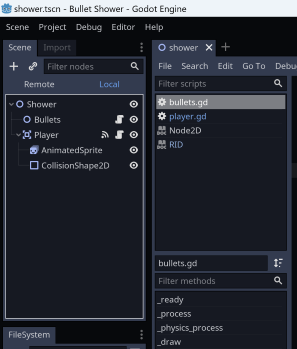
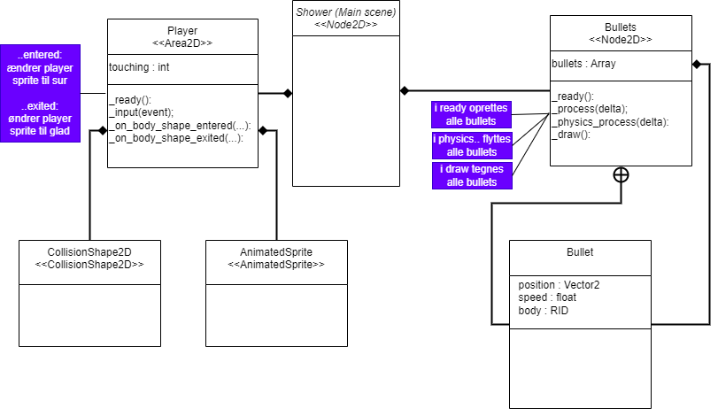

<h1>Tekniske diagrammer</h1>

I forbindelse udarbejdelsen af produktions kapitlet i jeres rapport. Skal i anvende forskellige former for tekniske diagrammer for at formidle jeres produkt.

## Klassediagrammer
Da godot er objektorienteret kan klassediagrammer med fordel bruges til at lave diagrammer scener i godot-projektet.

I kan feks. læse om klasser, objekter og klassediagrammer på wikipedia: 
- [https://en.wikipedia.org/wiki/Class_diagram](https://en.wikipedia.org/wiki/Class_diagram)
- [https://en.wikipedia.org/wiki/Class_(computer_programming)](https://en.wikipedia.org/wiki/Class_(computer_programming))

Vi har valgt her at illustere anvendelse af klassediagrammet ud fra det meget enkle demo spil kaldet "bullet shower", som kan ses her:
- [som plugin](https://godotengine.org/asset-library/asset/887)
- [source kode github](https://github.com/godotengine/godot-demo-projects/blob/master/2d/bullet_shower/README.md) 

Der er kun en scene i programmet kaldet "Shower". Som ses her:

Klassediagrammet ses nedenfor:  

Læg mærke til, at kun de noder, der indholder scripts har indhold i form af variabler og funktioner. De andre noder, der ikke indholder scripts er tomme kasser.   
Der er anvendt to typer pile.    
Den første pil er en såkaldt "kompositions-pil", der betyder at en klasse indholder et eller flere objekt af den anden klasse. Det kan ses direkte i editoren, hvis der er en "parent-node" og en "child-node".    
Den anden pil indikerer der er en "indre-klasse". Denne bruges da "bullets-scriptet" indeholder koden for en klasse kaldet "Bullet".       
Man skal huske at det overordnede formål med et diagram er at formidle, hvordan dele ad jeres projekt eller program virker, derfor er det en god ide at lave små tekst-bokse i klassediagrammer, der forklarer funktionaliteten.

